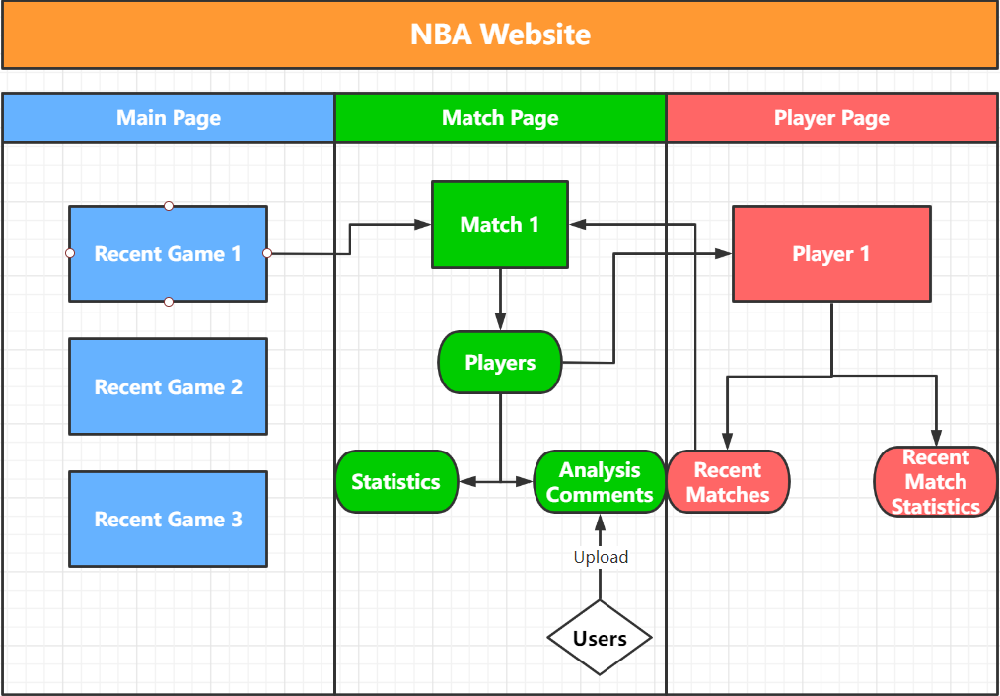
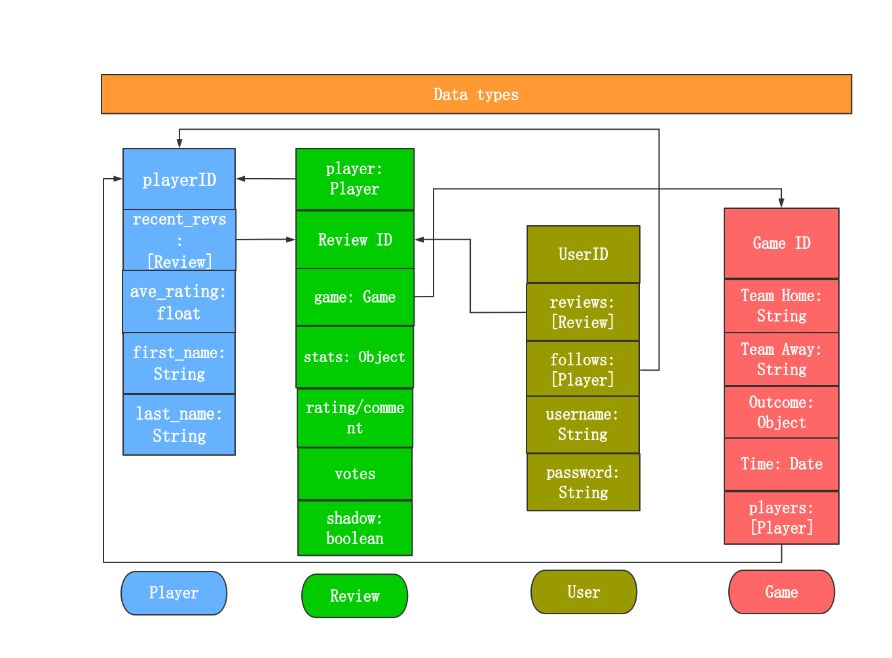

# Athlete In-depth

repo:https://github.com/Jayusc/AID

## Summary and Description

This repo contains a three parts: backend/,frontend/ and data/, the app runs with four containers together: Front, Back, mongodb and mongo-express.
Front and Back roots in their own volumn respectivly, data/ holds the data in mongoDB and serveral version of databases we dumped.

## Architecture

### App


Our project is divided into three phases. In the first phase it’s a web-application, a front-end webpage working with a Node.js backend pulling game stats everyday, users can comment and rate on the webpage or querying our GraphQL API. Game stats and user comments are stored and managed by through mangoDB.


### Data Schema

There are four types of data that consists our whole business logic.


## How to run

Front-end Port: 3011\
Back-end Port: 3022

```
docker-compose up
```

Then exec into the mongoDB container to retrieve data

```
docker exec -it [container id] /bin/bash
//cd into the data directory
cd data/db
//restore data from file mongodump-v8
mongorestore -h=mongodb:27017 -u=admin -p=password --authenticationDatabase=admin mongodump-v8/
```

Look that terminal, when "aid-backend" displays "GraphQL is running" and "aid-frontend" logs vue serving,
checkout webpage at localhost:3011/ and GraphiQL at localhost:3022/ . Detail in yaml file.

## GraphiQL queries

Checkout app/backend/schema.graphql to see supported queries and mutations.
