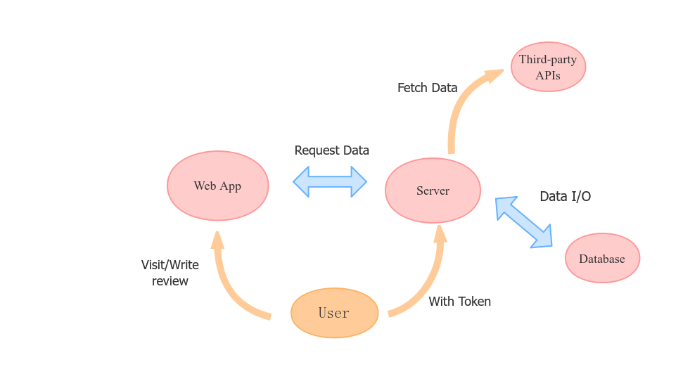
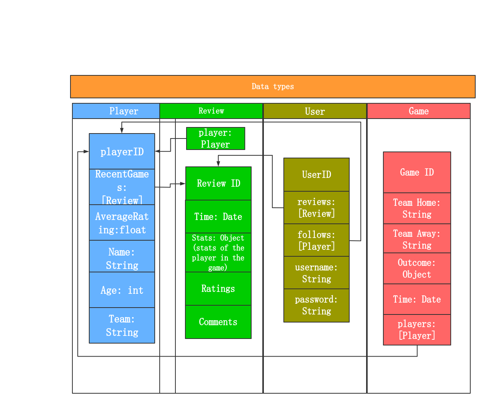

# Athlete In-depth

## Summary and Description

In this project we purpose to build a pure review platform for athletes in every single game, helping readers and strategy makers gain an overview of certain player in one game or the whole career.

### Best postgame reviews of the player

## Proposed Architecture

### App

Our project is divided into three phases. In the first phase it’s a web-application, a front-end webpage working with a Node.js backend pulling game stats everyday, users can comment and rate on the webpage or querying our GraphQL API. Game stats and user comments are stored and managed by through mangoDB.


### Data Schema

There are four types of data that consists our whole business logic.


## Develop

Front-end Port: 3011
Back-end Port: 3022

```
docker-compose up
```

To commit changes, first stop container.

```
docker-compose down
```

If docker-compose file or Dockerfile is modified, delete both images and re-up.
